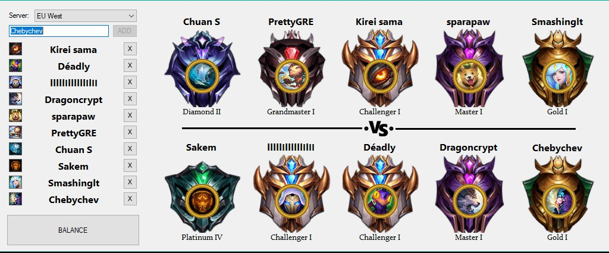

# League of Legends Custom Games Balancer (a.k.a LCGB)

[Download and VirusTotal links are here](https://github.com/TheFizz/LCGB-RAPI/releases)

Since LoL has no internal tool for balancing custom games I've developed my own to help me organize custom games tournaments within the club.

This tool utilizes native Riot API to divide 10 players into 2 teams of similar solo rankings. It is written in C# and is currently in beta, so you might need to download .Net framework 4.6.1.

How this works:

- Fill the empty text box with a nickname

- Click Add or hit Enter

- Repeat 9 more times

- Click "Balance"

10 summoners will be divided into 2 teams with ranks shown.

If you happen to notice something like =*{rank}*=, it means that the displayed rank is the rank of the previous season.

